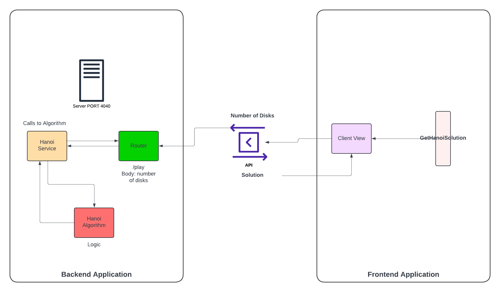

# Towers of Hanoi

Author: Krystel Baca

### Game Objective

The tower of Hanoi is a mathematical puzzle. It consists of three rods and several disks of
different diameters, which can slide onto any rod. The puzzle starts with the disks stacked on one rod in order of decreasing size, the smallest at the top, thus approximating a canonical shape. The objective of the puzzle is to move the entire stack to the last rod.

**Rules**

There are three simple rules:

1. ***Only one disk may be moved at a time.***
2. ***Each move consists of taking the upper disk from one of the stacks and placing it on
top of another stack or an empty rod.***
3. ***No disk may be placed on top of a disk that is smaller than it.***
---

# Implementation


### Components

<table>
  <tr>
    <td>
      <strong>Components</strong>
    </td>
    <td>
      <strong>Description</strong>
    </td>
    <td>
      <strong>Props</strong>
    </td>
  </tr>
  <tr>
    <td>
      <strong><code>Controls</code></strong>
    </td>
    <td>
      Handle the controls and the logic about the game
    </td>
    <td>
      Receive the disks to play {numDiks}
    </td>
  </tr>
  <tr>
    <td>
      <strong><code>PlayHanoi</code></strong>
    </td>
    <td>
      Extract the logic when the game mode is Playable
    </td>
    <td>
      -
    </td>
  </tr>
  <tr>
    <td>
      <strong><code>Display Hanoi</code></strong>
    </td>
    <td>
      This component is the one that display the tower using animation library framer-motion, according to the logic and game mode
    </td>
    <td>
      Receives the rods, the props when the game is playable or autosolve mode.
    </td>
  </tr>
  <tr>
    <td>
      <strong><code>Solution Steps</code></strong>
    </td>
    <td>
      This component is receiving the moves, from context to display a list
    </td>
    <td>
      -
    </td>
  </tr>
  <tr>
    <td>
      <strong><code>Context: MovesContext </code></strong>
    </td>
    <td>
     Shared the moves context to the whole app
    </td>
    <td>
      The context about the moves of the game based on the number of disks received.
    </td>
  </tr>
  </tr>

</table>


## Project structure

The project's <strong>file tree</strong> file tree and a brief note on each file's relevancy:

```
hanoi-backend/
├── src/
│   ├── App.js
│   ├── controllers
│   │   ├── playController.js
│   ├── services
│   │   ├── playService.js
│   └── util
│       ├── Hanoi.js
├── Router.js
```

```
hanoi-tower-client/
├── src/
│   ├── api/
|       ├── HanoiService.js
│   ├── components
│   │   ├── Aside.jsx
|   |   ├── Controls.jsx
|   |   ├── DisplayHanoi.jsx
|   |   ├── Home.jsx
|   |   ├── MainContainer.jsx
|   |   ├── PlayHanoi.jsx
|   |   ├── SolutionSteps.jsx
│   ├── context/
│   │   ├── MovesContext.jsx
│   └── hooks/
│       ├── auto-solve/
|       ├──├── AutoSolveHanoi.jsx
        ├── playable/
|       ├──├── usePlayHanoi.js
|   ├── styles/
│   │   ├── App.css
        ├── Aside.css
│   │   ├── Hanoi.css
├── App.js
```

---

### Architecture Diagram




### Instructions to run the project:
#### hanoi-backend:
Steps to run the project:

`cd hanoi-backend/`

`npm install`

`npm start` 

Server running at: `localhost:4040`

#### hanoi-tower-client

`cd hanoi-tower-client/`

`npm install`

`npm start` 

Server running at: `localhost:3000`